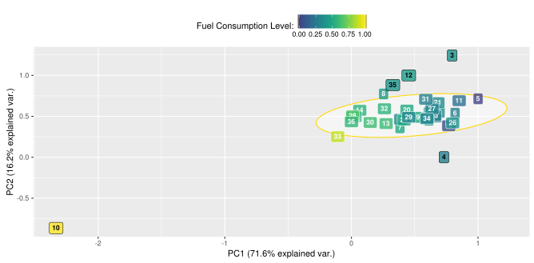

```{r setup, include=FALSE}
## Load required packages
library('readr')
library('dplyr')
library('lubridate')
library('ggplot2')
library('GGally')
library('magrittr')
library("DT")

## Read csv and format date
trip.data <- read_csv('../data/trip_data.csv') %>%
   mutate(date = ymd_hms(date, tz = 'UTC'))

options(htmltools.dir.version = FALSE, cache = TRUE)
```

name: about-me
class: top, left
background-image: url(./img/me.png)
background-size: 70%
background-position: center middle

# Quem sou eu?

.footnote[
------

- **Website:** [http://davpinto.com](http://davpinto.com)
- **GitHub:** [https://github.com/davpinto](https://github.com/davpinto)
- **Email:** david@nexer.com.br
]

???
(Quem vos fala?) Falar sobre minha formação, com foco em como iniciei na área de 
machine learning e como comecei a trabalhar de fato na área. Contar a história 
de como iniciei na Nexer (Danilo Mattos, CEO, chegou no meu laboratório da 
graduação dizendo que estava coletando dados de carros e precisava analisá-los.
Foi quando identificamos alguns padrões que indicavam que o veículo tinha 5 
marchas. No entanto, o algoritmo acusava 7. Era um modelo que estava pra entrar 
no mercado, e realmente tinha 7 marchas.)

---
template: about-me
background-image: none

- Bacharel em **Engenharia de Controle e Automação** pela *UFMG*

- Mestre em **Inteligência Computacional** pelo *PPGEE* da *UFMG*

- **Co-founder** e **CAO** da Nexer

---
class: inverse, center, bottom
background-image: url(./img/nexer-cover.jpg)
background-size: contain

# Nexer

Big Data e Analytics para Carros Conectados

???
Pergunto quem conhece a Nexer, logo após dizer minha colocação na empresa.

---
class: left, top
background-image: url(./img/logo-nexer.png)
background-size: 80px
background-position: 90% 8%

# Nexer


???
Explico brevemente a solução, que tem como objetivo usar Big Data, ML e Int. Art. 
para facilitar a vida do motorista.

---
class: inverse, center, middle

# Que dados coletamos?

---
class: center, top

```{r, echo=FALSE, fig.height=8, fig.width=10, dev='svg'}
### Plot matrix for trip 3
trip.data %>% 
   filter(trip == 3) %>%
   select(-trip, -km, -fuel, -date) %>%
   ggpairs(
      upper = list(continuous = wrap("cor", size = 4)),
      lower = list(
         continuous = wrap("points", size = 1, alpha = 0.6, shape = 18)
      ),
      diag = list(
         continuous = wrap("densityDiag", size = 0.5, fill = 'gray40', 
                           color = 'gray50', alpha = 0.6)
      )
   )
```

???
Nesse ponto é interessante começar a ressaltar a importância de se fazer perguntas aos dados

---

```{r, echo=FALSE, tidy=FALSE}
trip.data %>% 
   filter(trip == 3) %>%
   select(-trip, -km, -fuel, -date) %>%
   head(n = 30) %>%
   DT::datatable(
      fillContainer = FALSE, 
      options = list(pageLength = 10, scrollX = TRUE)
   )
```

---
class: inverse, bottom, left
background-image: url(./img/ml-icon.png)
background-size: 250px
background-position: 90% 16%

# Let's play with Machine Learning!

---
class: top, left

# Resumo dos Trajetos


???
Como machine learning está presente no dia-a-dia da Nexer?

---

# Troca de Marcha


---

# Horários de Uso


---

# Consumo de Combustível


---

# Dinâmica do Veículo


---

# Próxima Manutenção


---

# Trajetos Atípicos



---
class: inverse, center, middle

# Como aprender Machine Learning?

---
class: top, left

# Pré-requisitos

- estatística descritiva (interpretação e resumo de dados)

--

- inferência estatística (distribuições de probabilidade, significância estatística e teste de hipóteses)

--

- um pouco de matemática (álgebra linear)

--

- e uma linguagem de programação<sup>1</sup> (recomendado R ou Python)

.footnote[

[1] Visualização de dados é fundamental no dia-a-dia de quem trabalha com ML. Portanto, é muito importante dominar uma biblioteca gráfica (`ggplot2` em R e `matplotlib` em Python).

]

???
Pré-disposição e vontade de aprender são fundamentais

---
class: inverse, center, middle

# Cursos On-line

---
class: top, left

### Datacamp (site ótimo!)

- [Intro to Statistics with R](https://www.datacamp.com/courses/intro-to-statistics-with-r-introduction) (Descriptive Statistics)

- [Data Analysis and Statistical Inference](https://www.datacamp.com/community/open-courses/statistical-inference-and-data-analysis)

### Udacity

- [Intro to Descriptive Statistics](https://br.udacity.com/course/intro-to-descriptive-statistics--ud827/)

- [Intro to Inferential Statistics](https://br.udacity.com/course/intro-to-inferential-statistics--ud201/)

### Coursera

- [Machine Learning](https://pt.coursera.org/learn/machine-learning) (Andrew Ng)

### MIT

- [Linear Algebra](https://ocw.mit.edu/courses/mathematics/18-06-linear-algebra-spring-2010/) (Gilbert Strang)

---
class: inverse, center, middle
background-image: url(./img/r-logo.svg)
background-size: 200px

---
class: top, left

# Bibliotecas

- `tidyverse` (Manipulação de Dados)

- `ggplot2` (Visualização de Dados)

- `caret` ou `mlr` (Machine Learning)

- `mlbench` (Bases de Dados de ML)

---
background-image: url(./img/r_basic_cover.jpg)
background-size: 30%
background-position: center 90%

# Básico de R

[Hands-On Programming with R](https://www.amazon.com/Hands-Programming-Write-Functions-Simulations/dp/1449359019) (Garrett Grolemund) ou [The Art of R Programming](https://www.amazon.com/Art-Programming-Statistical-Software-Design/dp/1593273843/ref=sr_1_1?s=books&ie=UTF8&qid=1484790516&sr=1-1) (Norman Matloff)

---
background-image: url(./img/r_data_cover.jpg)
background-size: 30%
background-position: center 90%

# Data Science

[R for Data Science](https://www.amazon.com/Data-Science-Transform-Visualize-Model/dp/1491910399/ref=asap_bc?ie=UTF8) (**Hadley Wickham** and Garrett Grolemund) - disponível [online](http://r4ds.had.co.nz/).

---
background-image: url(./img/r_ml_cover.jpg)
background-size: 30%
background-position: center 90%

# Machine Learning

[Machine Learning with R](https://www.amazon.com/Machine-Learning-Second-Brett-Lantz/dp/1784393908/ref=sr_1_1?s=books&ie=UTF8&qid=1484790729&sr=1-1) (Brett Lantz)

---
class: inverse, center, middle
background-image: url(./img/python-logo.svg)
background-size: 200px

---
class: top, left

# Bibliotecas

- `statsmodels` (Estatística Descritiva e Inferência)

- `pandas` (Manipulação de Dados)

- `matplotlib` e `seaborn` (Visualização de Dados)

- `sklearn` (Machine Learning)

---
background-image: url(./img/python_basic_cover.png)
background-size: 30%
background-position: center 90%

# Básico de Python

[A Whirlwind Tour of Python](http://www.oreilly.com/programming/free/a-whirlwind-tour-of-python.csp) (Jake VanderPlas) - Ebook gratuito.

---
background-image: url(./img/python_data_cover.jpg)
background-size: 30%
background-position: center 90%

# Data Science

[Python Data Science Handbook](https://www.amazon.com/Python-Data-Science-Handbook-Essential-ebook/dp/B01N2JT3ST) (Jake VanderPlas) - disponível [online](https://github.com/jakevdp/PythonDataScienceHandbook).

---
background-image: url(./img/python_ml_cover.jpg)
background-size: 30%
background-position: center 90%

# Machine Learning

[Python Machine Learning](https://www.amazon.com/Python-Machine-Learning-Sebastian-Raschka/dp/1783555130/ref=asap_bc?ie=UTF8) (Sebastian Raschka)

---
class: inverse, center, middle

# Livros Clássicos

---
background-image: url(./img/ml_book_01.jpg)
background-size: 30%
background-position: center 90%

## Machine Learning: An Algorithmic Perspective

### Stephen Marsland

---
background-image: url(./img/ml_book_02.jpg)
background-size: 30%
background-position: center 90%

## Applied Predictive Modeling

### Max Kuhn and Kjell Johnson

---
background-image: url(./img/ml_book_03.jpg)
background-size: 30%
background-position: center 90%

## The Elements of Statistical Learning (free)

### Trevor Hastie, Rob Tibshirani and Jerome Friedman

---
background-image: url(./img/ml_book_04.jpg)
background-size: 30%
background-position: center 90%

## An Introduction to Statistical Learning (free)

### Gareth James, Daniela Witten, Trevor Hastie and Robert Tibshirani

---
class: inverse, center, middle

# Como Praticar?

---
class: left, middle
background-image: url(./img/kaggle_logo.png)
background-size: 200px
background-position: 90% 8%

### Kaggle 

Kernels, datasets e desafios.

[https://www.kaggle.com](https://www.kaggle.com/)

### UCI

Dados usados em artigos de ML.

[https://archive.ics.uci.edu/ml](https://archive.ics.uci.edu/ml)

### Data.gov

Conjuntos de dados variados.

[https://www.data.gov](https://www.data.gov/)

---
class: inverse, center, middle

# Perguntas?
