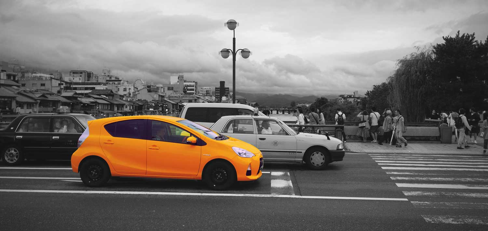

```{r setup, include=FALSE}
## Load required packages
library('readr')
library('dplyr')
library('lubridate')
library('ggplot2')
library('GGally')
library('magrittr')
library("DT")

## Read csv and format date
trip.data <- read_csv('../data/trip_data.csv') %>%
   mutate(date = ymd_hms(date, tz = 'UTC'))

options(htmltools.dir.version = FALSE, cache = TRUE)
```

name: about-me
class: top, left
background-image: url(../img/me.png)
background-size: 75%
background-position: center middle

# Quem sou eu?

.footnote[
------

- **Website:** [http://davpinto.com](http://davpinto.com)
- **GitHub:** [https://github.com/davpinto](https://github.com/davpinto)
]

???
(Quem vos fala?) Falar sobre minha formação, com foco em como iniciei na área de 
machine learning e como comecei a trabalhar de fato na área. Contar a história 
de como iniciei na Nexer (Danilo Mattos, CEO, chegou no meu laboratório da 
graduação dizendo que estava coletando dados de carros e precisava analisá-los.
Foi quando identificamos alguns padrões que indicavam que o veículo tinha 5 
marchas. No entanto, o algoritmo acusava 7. Era um modelo que estava pra entrar 
no mercado, e realmente tinha 7 marchas.)

---
template: about-me
background-image: none

- Bacharel em **Engenharia de Controle e Automação** pela *UFMG*

- Mestre em **Inteligência Computacional** pelo *PPGEE* da *UFMG*

- **Co-founder** e **CAO** da Nexer

---
class: inverse, center, bottom
background-image: url(../img/nexer-cover.jpg)
background-size: contain

# Nexer

Big Data e Analytics para Carros Conectados

???
Pergunto quem conhece a Nexer, logo após dizer minha colocação na empresa.

---
class: left, top
background-image: url(../img/logo-nexer.png)
background-size: 80px
background-position: 90% 8%

# Nexer



???
Explico brevemente a solução, que tem como objetivo usar Big Data, ML e Int. Art. 
para facilitar a vida do motorista.

---
class: inverse, center, middle

# Que dados coletamos?

---
class: center, top

```{r, echo=FALSE, fig.height=8, fig.width=10, dev='svg'}
### Plot matrix for trip 3
trip.data %>% 
   filter(trip == 3) %>%
   select(-trip, -km, -fuel, -date) %>%
   ggpairs(
      upper = list(continuous = wrap("cor", size = 4)),
      lower = list(
         continuous = wrap("points", size = 1, alpha = 0.6, shape = 18)
      ),
      diag = list(
         continuous = wrap("densityDiag", size = 0.5, fill = 'gray40', 
                           color = 'gray50', alpha = 0.6)
      )
   )
```

???
Nesse ponto é interessante começar a ressaltar a importância de se fazer perguntas aos dados

---

```{r, echo=FALSE, tidy=FALSE}
trip.data %>% 
   filter(trip == 3) %>%
   select(-trip, -km, -fuel, -date) %>%
   head(n = 30) %>%
   DT::datatable(
      fillContainer = FALSE, 
      options = list(pageLength = 10, scrollX = TRUE)
   )
```

---
class: inverse, bottom, left
background-image: url(../img/ml-icon.png)
background-size: 250px
background-position: 90% 16%

# Let's play with Machine Learning!

---
class: top, left

# Troca de Marcha

---

# Horários de Uso

---

# Consumo de Combustível

---

# Dinâmica do Veículo

---

# Densidade do Tráfego

---

# Próxima Manutenção

---
class: inverse, center, middle

# Pré-requisitos

---
class: inverse, center, middle
background-image: url(../img/r-logo.svg)
background-size: 200px

---
class: inverse, center, middle
background-image: url(../img/python-logo.svg)
background-size: 200px